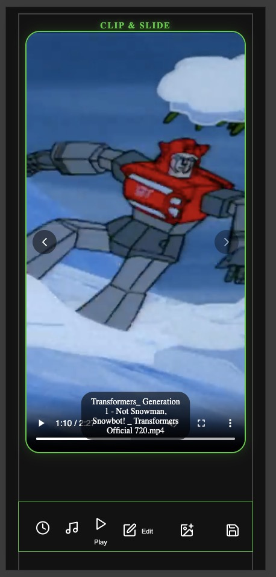
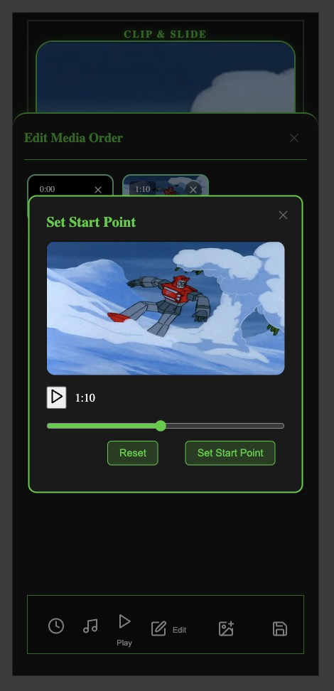
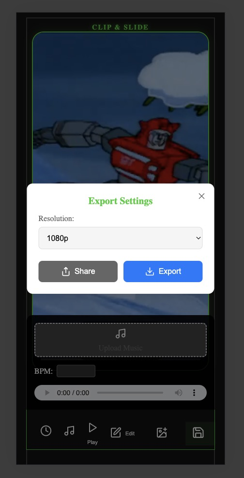

# Clip & Slide

A modern, interactive media slideshow creator built with React. Create engaging presentations by combining images, videos, and audio with customizable transitions, music synchronization, and export capabilities.





## Features

- **Multi-Media Support**
  - Upload and combine images, videos, and audio files
  - Add captions to any media type
  - Automatic media type detection and appropriate rendering

- **Interactive Controls**
  - Touch-enabled navigation with swipe gestures
  - Play/pause functionality
  - Customizable slide duration
  - Progress indicators for each slide

- **Advanced Media Management**
  - Drag-and-drop reordering of media
  - Set custom start points for video and audio clips
  - Delete unwanted slides
  - Edit captions

- **Music Integration**
  - Background music support
  - BPM-based slide timing synchronization
  - Music visualization for audio files

- **Export Capabilities**
  - Multiple resolution options (720p, 1080p, 2K)
  - FFmpeg-powered video processing
  - Cross-platform support (web and mobile)
  - Progress tracking during export

## Technical Stack

- **Frontend Framework**: React
- **Animation**: Framer Motion
- **Media Processing**: FFmpeg.wasm
- **Icons**: Lucide React
- **Mobile Support**: Capacitor
- **File Handling**: HTML5 File API, Capacitor Filesystem

## Installation

1. Clone the repository:
```bash
git clone https://github.com/yourusername/clip-and-slide.git
```

2. Install dependencies:
```bash
cd clip-and-slide
npm install
```

3. Start the development server:
```bash
npm start
```

## Usage

1. **Adding Media**
   - Click the "+" button or use the bottom menu to upload files
   - Supported formats: Images (PNG, JPG), Videos (MP4), Audio (MP3)

2. **Editing Content**
   - Click the Edit button to open the media management panel
   - Drag and drop items to reorder
   - Click on thumbnails to set video/audio start points
   - Add or edit captions as needed

3. **Customizing Playback**
   - Use the clock icon to adjust slide duration
   - Add background music and sync with BPM
   - Play/pause using the central control

4. **Exporting**
   - Click the save icon to open export options
   - Choose desired resolution
   - Wait for processing to complete
   - Download or share the final video

## Component Structure

- `StorySlider`: Main component managing the slideshow
- `BottomMenu`: Controls for playback and media management
- `EditPanel`: Interface for reordering and editing media
- `MusicPanel`: Music upload and BPM synchronization
- Modal Components:
  - `CaptionModal`: Add/edit captions
  - `StartPointModal`: Set media start points
  - `ExportModal`: Export settings and progress
  - `ProgressModal`: Processing feedback

## Contributing

1. Fork the repository
2. Create your feature branch: `git checkout -b feature/new-feature`
3. Commit your changes: `git commit -m 'Add new feature'`
4. Push to the branch: `git push origin feature/new-feature`
5. Submit a pull request

## License

This project is licensed under the MIT License - see the LICENSE file for details.

## Acknowledgments

- FFmpeg.wasm for video processing capabilities
- Framer Motion for smooth animations
- Lucide React for beautiful icons
- Capacitor for mobile support
# groove-slider-img
